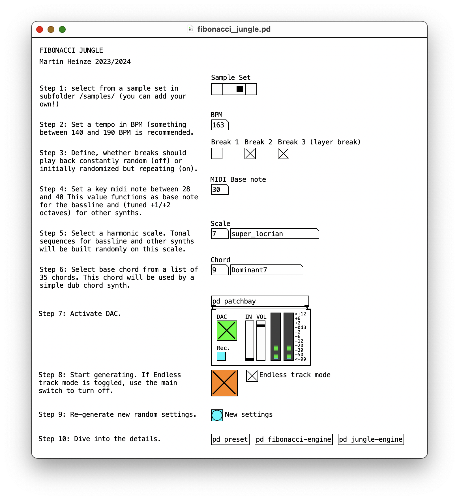
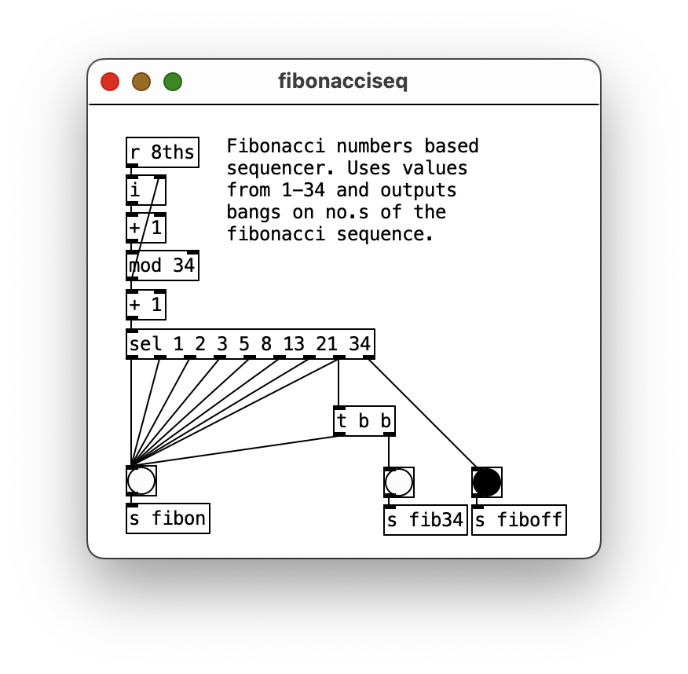
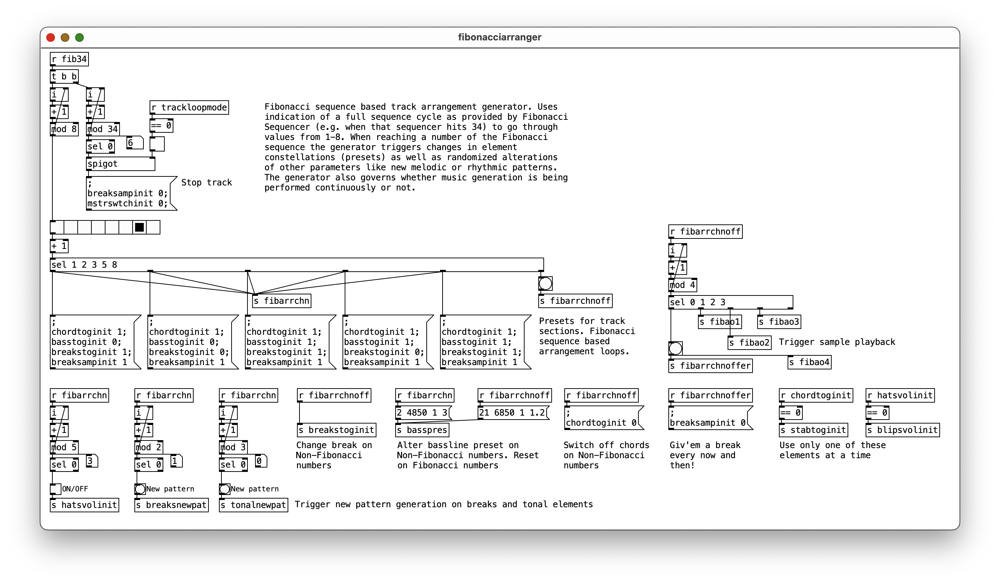
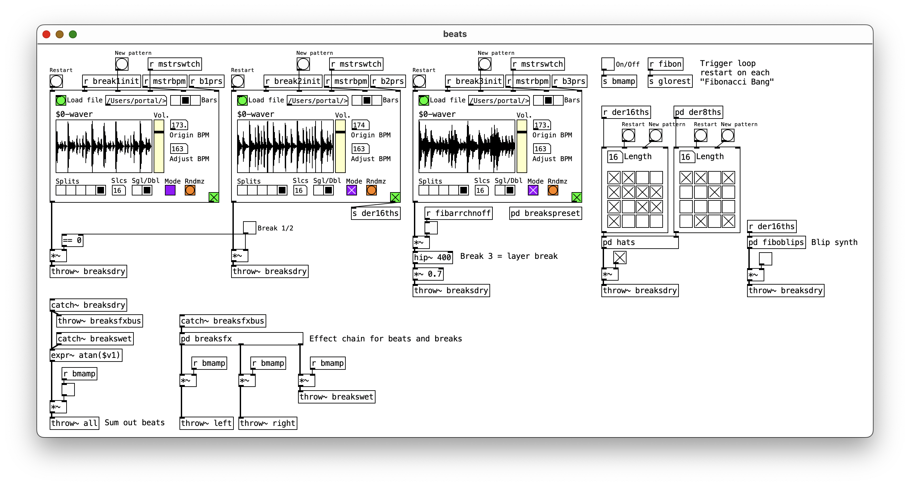
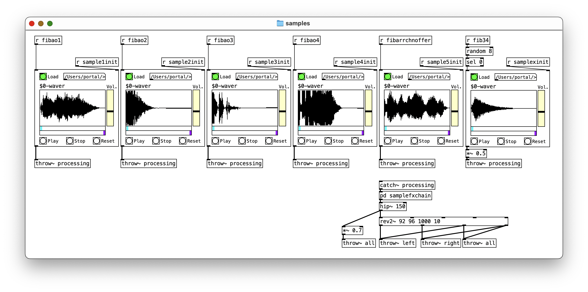
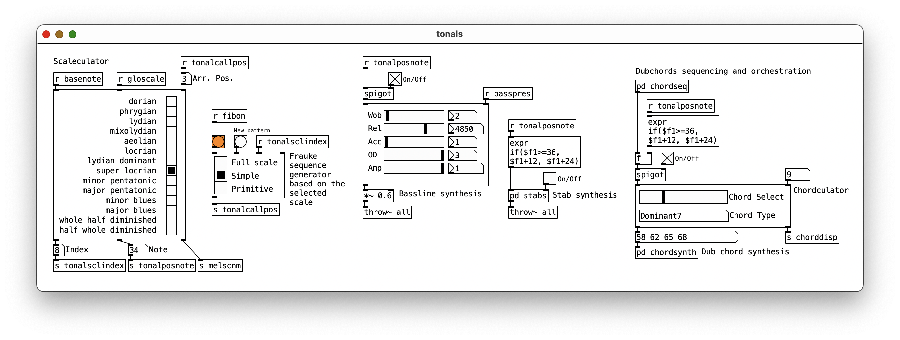

# Fibonacci Jungle
## About
POC for a simple to use generative framework for Jungle and Drum & Bass built on the Fibonacci number sequence as structural alternative to conventional meters and track build-up, written in Pure Data.

For a detailed description of concept and implementation, see [this paper](./assets/fibonacci-jungle_heinze-2023.pdf). There's also a presentation video from [Generative Music Prize 2024](https://forum.ircam.fr/article/detail/winners-of-the-generative-music-prize/), hosted by IRCAM, where Fibonacci Jungle was awarded 2nd place.

## Requirements and installation
* Install Pure Data >= 0.54
* Download else library via deken (optional)
* Check out or download this repository.
* Start **fibonacci_jungle.pd**
* Follow instructions in patch

*Note that work on single abstractions used in Fibonacci Jungle has progressed. Updated versions can be found in [PD-components](https://www.github.com/devstermarts/PD-components) repository.*

## The patch
### Main view
In the main patch view, session parameters like tempo, keynote and harmonic scale as well as breakbeat pattern behaviour can be set.

### Sequencing
In *fibonacci-engine* sub patch, tempo is defined using a metro object based on a given BPM. Note values are being processed for the changing bar meter in *fibonacciseq*.

In *fibonacciarranger*, the track build up and general arrangement are determined.

### Samplers and instruments
Breakbeat and other rhythmical patterns are generated randomly inside the *jungle-engine* sub patch.

In *samples*, a set of six sound fx samples are loaded and played back on given events.

*Tonals* contains both controllers and sound generators/ synthesizers for bassline, chords and stab sounds.

## Examples
[Fibonacci Jungle Versions](https://soundcloud.com/martsman/sets/fibonacci-jungle-versions) - an EP of recordings based on the Fibonacci Jungle framework. Each track/ version has been recorded multiple times and individually distributed through different channels ([Bandcamp](https://martsman.bandcamp.com/album/fibonacci-jungle-versions), [Nina](https://www.ninaprotocol.com/releases/martsman-fibonacci-jungle-version-set-5-nina-edition), [Spotify](https://open.spotify.com/intl-de/album/2OM6ZXuyjT7nSmYOccnF5w)).
